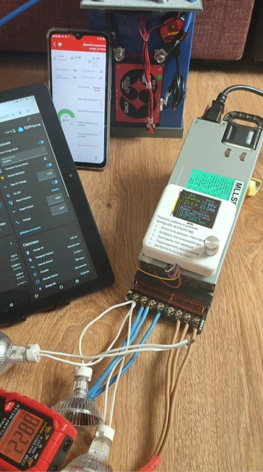

 

    
    
    
    

## 🌟 Описание Проекта
# Server Power Supply — Universal 100A Charger. Серверный блок питания - унаверсальное зарядное устройство.
Универсальный зарядный контроллер на базе ESP32 для переделки серверного блока питания в зарядное устройство до 100 А. Проект реализован в ESPHome, поддерживает CC/CV-зарядку LiFePO4/Li‑Ion, ПИ‑регулирование, мягкий старт и счётчики энергии.

## Особенности
* **CC/CV с защитой и гистерезисом:** автоматическое переключение между режимами постоянного тока и постоянного напряжения.
* **ПИ‑регулятор тока и напряжения:** реализован на коротких интервалах с ограничением шага и deadband для стабильности.
* **Мягкий старт:** плавное поднятие напряжения при включении выхода, чтобы не «дёргать» аккумулятор и не триггерить защиту БП.
* **Счётчики энергии:** накопление Ah и Wh в реальном времени, кнопка сброса счётчиков.
* **Гибкая настройка химии АКБ:** выбор типа батареи (LiFePO4, Li‑Ion и т.п.) через UI, автоматическое выставление порогов напряжения и логики завершения заряда.
* **Защита от отсутствия нагрузки:** детектирование режима «без нагрузки» по низкому току и высокому напряжению с безопасным отключением выхода.

Аппаратная часть
Контроллер: ESP32 (поддержка ESP‑IDF и ESPHome).
Блок питания: серверный БП с регулируемым выходом 8–14.5 В и спецвыводом для оценки тока (напряжение до 5–6 В).
Датчики тока: INA3221/INA219, шунты 0.00025 Ом и 0.00000625 Ом.
ЦАП: встроенный DAC ESP32 (GPIO25) с нелинейной калибровочной таблицей.
Дисплей: опционально ST7735 (графический интерфейс меню).
Ключевые технические решения
Замена ADC на INA3221: повышение точности измерения тока и напряжения, удаление шунтов и перерезание дорожек, прямое подключение каналов.
Нелинейная калибровка DAC: таблица из 10 точек для точного соответствия уровня ЦАП выходному напряжению БП.
Deadband и фильтрация: программные deadband и ограничение шагов ПИ‑регулятора для подавления скачков (особенно при низком внутреннем сопротивлении АКБ ~1 мОм).
Глобальные состояния: использование глобальных переменных для флагов (окончание зарядки, первый тик после включения, удержание порога CV и т.д.) вместо разрозненных компонентов.
Как это работает
Старт: при включении активируется мягкий старт — напряжение плавно поднимается до безопасного уровня.
Режим CC: ПИ‑регулятор удерживает целевой ток, корректируя выходное напряжение с ограничением по шагу.
Переход в CV: срабатывает только при достижении порогового напряжения и удержании этого состояния 60 секунд; дополнительно проверяется, что ток ниже целевого.
Возврат в CC: если в режиме CV ток снова превысит целевой (например, из‑за просадки АКБ), система возвращается в CC.
Завершение зарядки: фиксируется по длительному удержанию низкого тока (ниже 1% от целевого) и отключает выход.
Счётчики: Ah и Wh накапливаются в реальном времени и могут быть сброшены кнопкой.
Установка и запуск
Установите ESPHome (CLI или через Home Assistant).
Скопируйте test.yaml в папку конфигурации ESPHome.
Отредактируйте параметры под вашу аппаратную часть:
пороги напряжений и токов;
коэффициенты ПИ‑регулятора;
таблицу калибровки DAC;
значения сопротивлений шунтов.
Соберите и прошейте устройство:
bash
esphome run test.yaml
Подключите датчики, ЦАП и силовые цепи согласно схеме.
Конфигурация
Основной файл конфигурации: test.yaml. В нём реализованы:

логика CC/CV и ПИ‑регуляторов;
обработка интервалов 300–500 мс;
счётчики Ah/Wh и кнопка сброса;
таблицы калибровки и нелинейного преобразования DAC;
флаги и состояния (первый тик, удержание CV, завершение заряда и т.д.).
Важные замечания
Проект находится в стадии активной разработки и тестирования.
Перед подключением к аккумулятору обязательно проверьте пороги напряжений и логику отключения.
Максимальное напряжение ограничено на уровне 14.5 В (для LiFePO4 достаточно 14.4 В, перезаряд не допускается).
Не меняйте логику мягкого старта и deadband без понимания последствий — это критично для стабильности.
Вклад и обратная связь
Pull requests и issue приветствуются. Если вы нашли баг, нестабильность или хотите добавить новую функцию — создайте issue с логами и описанием проблемы.

Лицензия
Проект распространяется под лицензией MIT.
